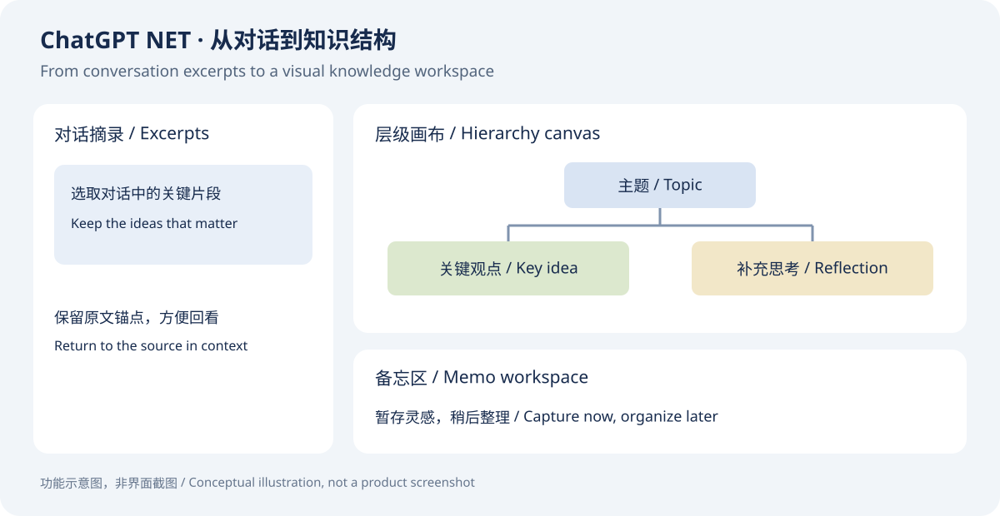
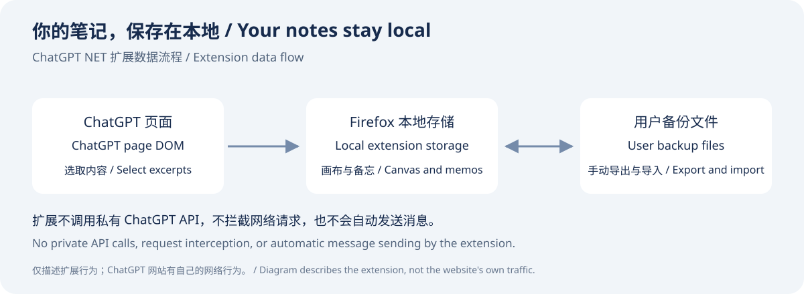

# ChatGPT NET 1.5.0

## 项目介绍 / Overview

ChatGPT NET 是一个 Firefox 本地扩展，用于将 ChatGPT 对话摘录组织成可视化层级，并在备忘区中暂存与整理想法。你可以保留摘录的原文锚点、添加自由节点、建立多父级关系，以及手动导入和导出备份。

ChatGPT NET is a local Firefox extension for organizing ChatGPT conversation excerpts into a visual hierarchy and memo workspace. Keep links to source excerpts, add your own notes, connect ideas with multiple parents, and manually export or import backups.



### 本地优先 / Local storage

笔记和画布保存在 Firefox 扩展本地存储中。扩展不调用私有 ChatGPT API、不拦截网络请求，也不自动发送消息。导出文件包含摘录内容和锚点信息，请自行妥善保管。此说明描述扩展行为，ChatGPT 网站本身仍会进行网络通信。

Notes and canvases are stored locally in Firefox extension storage. The extension does not call private ChatGPT APIs, intercept requests, or automatically send messages. Exported backups include excerpts and anchors; keep those files private when needed. These statements describe the extension, not the ChatGPT website's own network activity.



*以上为功能示意图，并非真实界面截图。 / These are conceptual illustrations, not product screenshots.*

## 版本与实现 / Version and implementation


Firefox extension implementation of **ChatGPT NET Functional Baseline 1.5**. Blank-canvas drops preserve the user's position intent; relation drops atomically auto-arrange only the affected hierarchy as a stable top-down tree/DAG. Independent subtree roots move their complete subtree rigidly, linked-node ordinary movement reroutes only incident edges, legal multi-parent relationships remain supported, and conversation canvases continue to follow `conversationId` across ChatGPT project moves. Unrelated notes and hierarchy components remain fixed.

The project remains independent from Chat Tree 0.4.3 and does not read or migrate the old `chat-tree:*` namespace.

## Install for live testing

1. Use Firefox 152 or newer.
2. Open `about:debugging#/runtime/this-firefox`.
3. Choose **Load Temporary Add-on**.
4. Select this directory's `manifest.json`.
5. Open a ChatGPT conversation.
6. Run `docs/MANUAL_ACCEPTANCE_1.5.md` plus the inherited 1.3 checks relevant to the environment.

The Firefox toolbar icon is the only show/close switch. There is no page-level `>>` or `<<` state. Closing ChatGPT NET removes the sidebar and highlighter DOM, restores ChatGPT's page width, and shuts down canvas timers/high-frequency observers; only the minimal extension message entry needed to receive the next toolbar click remains.

## Automated checks

From the project root:

```text
npm ci
npm test
python -m pip install -r requirements-test.txt
python -m playwright install chromium
python tests/browser_integration.py
$env:CHATGPT_NET_BROWSER='firefox'; python tests/browser_integration.py
node tests/firefox_extension_integration.mjs
```

`package.json` explicitly uses CommonJS for the Node audit files, so tests are not affected by a parent workspace's module mode. The browser test uses Playwright's installed Chromium by default and also runs against Firefox when `CHATGPT_NET_BROWSER=firefox`. Set `CHATGPT_NET_CHROMIUM` or `CHATGPT_NET_FIREFOX` only when an explicit executable override is needed.

## Build the Firefox package

See [build dependency security notes](docs/BUILD_DEPENDENCY_SECURITY.md) for resolved and outstanding tooling advisories.

Use Node.js 24 LTS. Run `npm ci` once, then `npm run build`. The project pins Firefox's official `web-ext` builder to 10.6.0. It creates `dist/ChatGPT-NET-<version>.zip`; the build also writes the identical bytes as `dist/ChatGPT-NET-<version>.xpi` for Firefox-native naming. Both contain only `manifest.json`, `background.js`, `icons/` and `src/`. Baseline documents, release notes, tests, screenshots and historical packages remain outside the installable extension because they have no runtime role.

`browser_integration.py` uses a real browser with a deliberately difficult mock ChatGPT layout. `firefox_extension_integration.mjs` uses Mozilla geckodriver, a disposable Firefox profile and the built XPI on the real `chatgpt.com` domain. Together they cover excerpts, hierarchy, manual movement, rigid subtrees, multi-parent rules, memo transfer, project-shaped URL moves, scroll isolation, DOM reuse and resource behavior.

## Key files

- `docs/README.md` — document index and local directory policy.
- `docs/ChatGPT NET Functional Baseline 1.5.md` — current 1.5.0 product baseline.
- `docs/BASELINE_RECHECK_1.5.0.md` — clause 1–116 implementation and evidence matrix.
- `docs/MANUAL_ACCEPTANCE_1.5.md` — Windows Firefox 1.5 acceptance checklist.
- `docs/RELEASE_NOTES_1.5.0.md` — 1.5 changes, validation evidence and package hash.
- `docs/ChatGPT NET Functional Baseline 1.3.md` — repository-only development baseline, clauses 1–500; it is not included in the extension package.
- `docs/BASELINE_AUDIT_1.3.md` — source/automated audit, including a clause-by-clause matrix.
- `docs/MANUAL_ACCEPTANCE_1.3.md` — current Windows Firefox live acceptance checklist.
- `docs/BASELINE_RECHECK_1.4.0.md` — 1.4.0 recheck of all 46 baseline chapters and all A–R acceptance groups.
- `docs/RELEASE_NOTES_1.4.0.md` — corrective-release changes and validation evidence.
- `docs/RELEASE_NOTES_1.4.1.md` — live-test root causes, fixes and Firefox evidence.
- `docs/BASELINE_RECHECK_1.4.2.md` — return-to-1.3 recheck and regression mapping.
- `docs/RELEASE_NOTES_1.4.2.md` — route stability, interaction fixes and reference-design scope.
- `docs/BASELINE_RECHECK_1.4.3.md` — full 46-chapter and A–R recheck for the hierarchy-arrangement release.
- `docs/RELEASE_NOTES_1.4.3.md` — organization-chart layout, scope and validation evidence.
- `docs/BASELINE_RECHECK_1.4.4.md` — full recheck after the complex multi-parent routing correction.
- `docs/RELEASE_NOTES_1.4.4.md` — structured-only hierarchy routing and obstacle-placement changes.
- `docs/BASELINE_RECHECK_1.4.5.md` — full recheck after legacy-layout repair, connected-node movement and memo compaction.
- `docs/RELEASE_NOTES_1.4.5.md` — user-visible fixes and measured browser evidence.
- `docs/BASELINE_RECHECK_1.4.6.md` — final 46-chapter and A–R recheck after performance and interaction corrections.
- `docs/RELEASE_NOTES_1.4.6.md` — release-readiness fixes plus Chromium, Firefox and web-ext evidence.
- `src/shared/schema.js` — canvas/global data validation.
- `src/shared/graph.js` — multi-parent DAG operations.
- `src/content/hierarchy.js` — bounded top-down tree/DAG arrangement for relation changes.
- `src/content/router.js` — stable, shared-trunk, hard-conflict-aware orthogonal routing.
- `src/content/ui.js` — host page reservation, overlays/highlights, modals.
- `src/content/main.js` — interaction state machine and application orchestration.
- `background.js` — per-tab toolbar state and conflict-aware persistence.

## Privacy / network behavior

The extension uses only local Firefox extension storage and ChatGPT page DOM. It does not call a private ChatGPT API, does not use `fetch`/XHR for ChatGPT, does not intercept ChatGPT network requests, and does not automatically send messages.

Exports contain ChatGPT excerpts and anchor information. Baseline 1.3, legacy 1.4 and current 1.5 backups are validated before writes, and an existing conversation is resolved as a complete-version choice rather than silently merged. New exports identify Functional Baseline 1.5; the canvas schema remains version 1.

For the geckodriver integration test, set CHATGPT_NET_FIREFOX to your Firefox executable. Set CHATGPT_NET_GECKODRIVER if geckodriver is outside the ignored output/geckodriver directory.

## License

MIT License. Copyright (c) 2026 MedicalZZ. See [LICENSE](LICENSE).

Generated ZIP/XPI packages belong in GitHub Releases and are not committed to this source repository.
